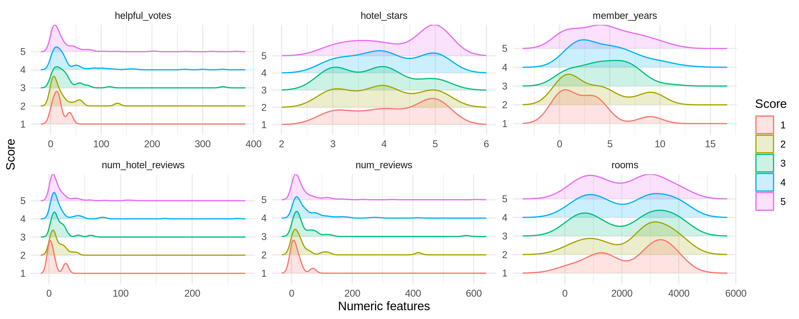
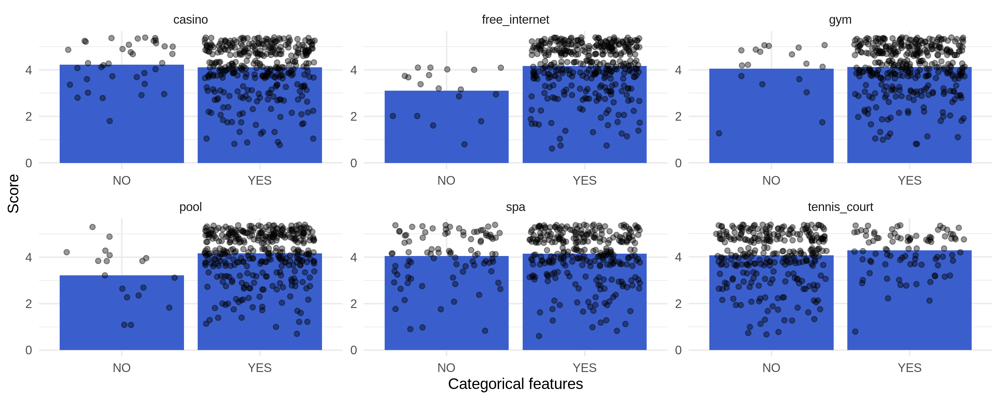
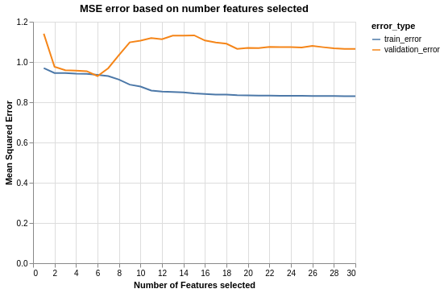

What Happens in Vegas: Predicting Hotel Ratings From Hotel and User Data
================
Bronwyn Baillie, Arun Maria, Manish Joshi  
2020/1/24 (updated: 2020-01-29)

# Summary

In this project, we build a regression model that uses data collected
from TripAdvisor user reviews of Las Vegas hotels to predict what kind
of user ratings can be expected for a hotel (Moro 2017). Exploratory
data analysis was performed in R on only a portion of our data reserved
for training (R Core Team 2019). In our preliminary EDA, we checked the
effect of different user and hotel specific features against user
ratings, and it became apparent that most features did not have much
impact on the hotel ratings. However, upon further analysis throughout
our project we discovered that some features, such as the presence of a
swimming pool, free wifi, and user continent, did have an effect on
hotel ratings.

# Introduction

Most travel and hotel bookings nowadays are being made online, and one
of the key parameters a potential consumer refers to before deciding on
which hotel to book is the ratings given to a hotel by users who had
previously visited. For this project we wanted to be able to predict the
expected user rating of a hotel, given various features about both the
user and the hotel, and determine which user and hotel features had the
most effect on that rating. Tourism industry professionals, travel
agents, investors, and Hotel owners who wish to attract clients can draw
benefit from such a model.

# Methods

## Data

The Dataset chosen for the research project is the “Las Vegas Strip
Dataset” which is collated information about customer feedback on 21
Hotels located in the Las Vegas Strip. The data is extracted from
popular, respected and well-regarded travel portal “TripAdvisor”. -Moro,
S., Rita, P., & Coelho, J. (2017). Stripping customers’ feedback on
hotels through data mining: The case of Las Vegas Strip. Tourism
Management Perspectives, 23, 41-52. It was sourced from the UCI machine
learning repositories, and can be found
[here](https://archive.ics.uci.edu/ml/datasets/Las+Vegas+Strip). Each
row in the data set represents information about one user review, and
contains variables such as the name of the hotel, amenities present in
the hotel such as a swimming pool, spa, or wifi, imformation about the
reviewer like the number of reviews they’ve given and the number of
years they’ve been a member, all along with the user’s rating for the
hotel.

## Analysis

From the preliminary EDA, it became apparent that some features did not
have much impact on the hotel ratings, whereas other features such as
the presence of a swimming pool and free wifi showed a potential effect.
Many of these realizations came from visualizations made using the
ggplot2 library in R (Wickham
2016).

The training of the model was done in Python (Van Rossum and Drake
2009), and mean squared error (MSE) was used to measure model
performance. We chose to use MSE because our goal is to create a model
that has very strong predictive abilities, and MSE is a good way of
interpreting how well a model performs. The model performed poorly with
a high MSE when all the features were used in the training dataset, so
scikit-learn’s recursive feature elimination function was used to remove
unnecessary features and improve our model (Pedregosa et al. 2011). The
improvements in error can be seen visualized below using altair (Sievert
2018).

Our model showed the most promise in terms of both training and
validation errors when we limited our model to have just 3 features. The
3 features selected were whether or not the hotel had a swimming pool,
whether or not the hotel had free Wifi, and the user’s continent. These
metrics were in line with what was seen during the EDA stage.

The Model was then trained using different regression algorithms such as
a linear regression, an RFregressor, Lasso, ridge regression, and SVM,
all from the sklearn package in Python. 10-fold cross validation was
used to determine the best hyperparameters when possible. It was found
that the best performing algorithm on the validation set was the ridge
regression (regularized linear regression) and this was chosen as the
final model.

# Results

  - Results of the model while hyperparameters were being tuned are
    shown below. The error metric used is MSE (mean square error)

  - The final error obtained on the unseen test data is 0.867 which is
    similar to the training error obtained. The model generalizes well
    and does not
overfit.

# References

Moro, Rita, S. 2017. “UCI Machine Learning Repository.” University of
California, Irvine, School of Information; Computer Sciences.
<https://archive.ics.uci.edu/ml/datasets/Las+Vegas+Strip>.

Pedregosa, F., G. Varoquaux, A. Gramfort, V. Michel, B. Thirion, O.
Grisel, M. Blondel, et al. 2011. “Scikit-Learn: Machine Learning in
Python.” *Journal of Machine Learning Research* 12: 2825–30.

R Core Team. 2019. *R: A Language and Environment for Statistical
Computing*. Vienna, Austria: R Foundation for Statistical Computing.
<https://www.R-project.org/>.

Sievert, Jacob VanderPlas AND Brian E. Granger AND Jeffrey Heer AND
Dominik Moritz AND Kanit Wongsuphasawat AND Arvind Satyanarayan AND
Eitan Lees AND Ilia Timofeev AND Ben Welsh AND Scott. 2018. “Altair:
Interactive Statistical Visualizations for Python.” *The Journal of Open
Source Software* 3 (32). <http://idl.cs.washington.edu/papers/altair>.

Van Rossum, Guido, and Fred L. Drake. 2009. *Python 3 Reference Manual*.
Scotts Valley, CA: CreateSpace.

Wickham, Hadley. 2016. *Ggplot2: Elegant Graphics for Data Analysis*.
Springer-Verlag New York. <https://ggplot2.tidyverse.org>.

